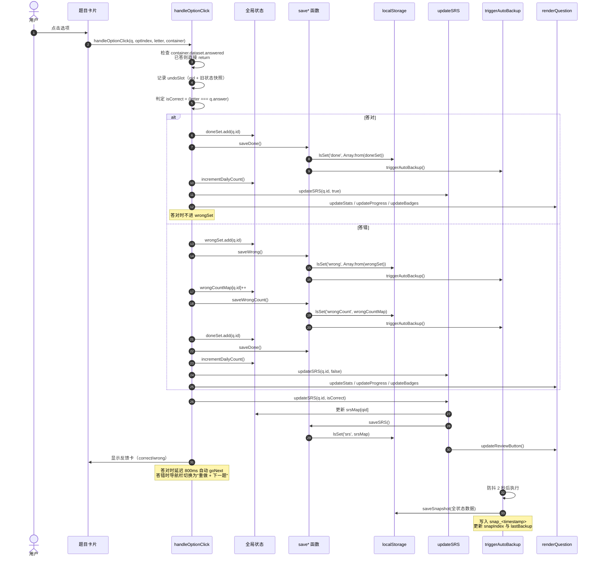
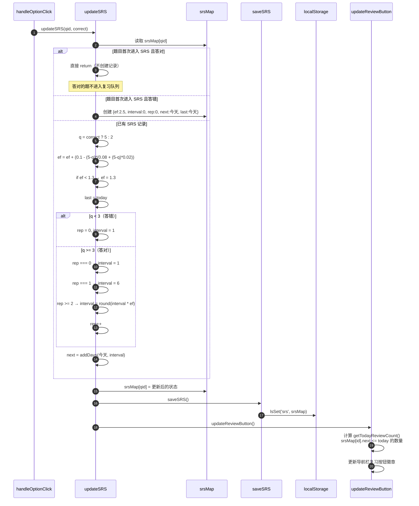
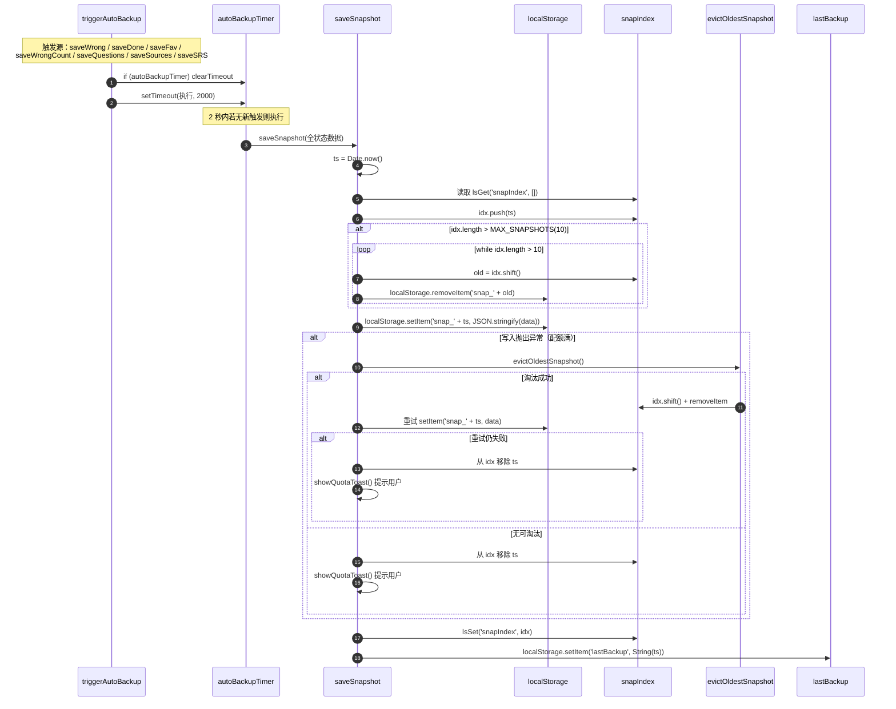
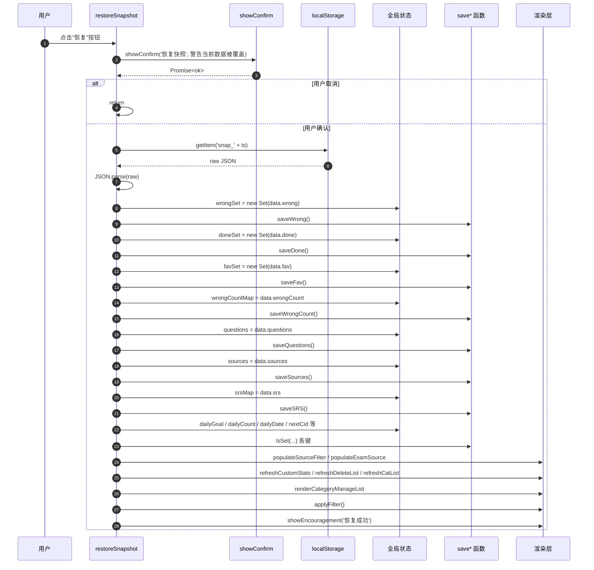
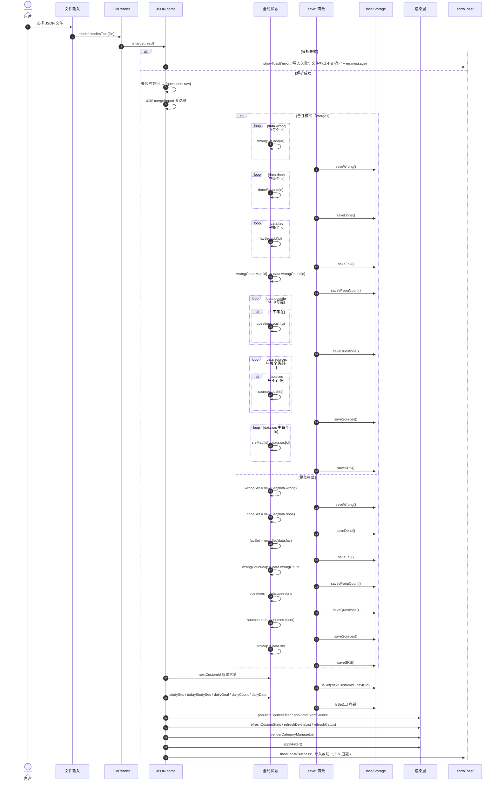

# 数据流图

> 题库项目关键数据流分析
> 主文件：`[题库]交互式刷题页面.html`

---

## 1. 答题数据流

用户点击选项后的完整数据流。一次答题会同时更新多个状态集合，并触发异步快照备份。

---

## 2. SRS（SM-2 间隔复习）数据流

SM-2 算法的核心数据流，决定每道题的下次复习时间。

---

## 3. 快照数据流

自动备份与恢复的数据流。`triggerAutoBackup` 使用 2 秒防抖避免频繁写盘。

### 恢复快照流程

---

## 4. 导入数据流

支持两种导入模式：覆盖（默认）与合并。合并模式用于跨设备同步进度。

---

## 5. 数据一致性保障

### 5.1 写穿透策略

每次状态变更立即调用对应 `save*` 函数落盘，不存在"内存已改但未持久化"的窗口。代价是连续答题会触发多次 `lsSet`，但 `triggerAutoBackup` 通过 2 秒防抖避免了快照频繁写入。

### 5.2 配额保护链

`lsSet` 失败 → `evictOldestSnapshot` 淘汰最旧快照 → 重试一次 → 仍失败 → `showQuotaToast` 显式提示用户导出。任何失败都不静默吞掉。

### 5.3 快照索引与数据原子性

`snapIndex`（快照时间戳数组）与 `snap_<ts>`（快照数据）分开存储。写入顺序：
1. 先写 `snap_<ts>` 数据
2. 再写 `snapIndex` 索引

若第一步失败，索引未更新，不会出现"索引指向空数据"的脏状态。删除时同样先 `removeItem` 数据，再更新索引。

### 5.4 恢复操作的二次确认

`restoreSnapshot` / `deleteSnapshot` 必须通过 `showConfirm` 二次确认才能执行，避免误操作覆盖当前进度。恢复成功后通过 `showEncouragement` 显式反馈。

### 5.5 每日数据重置

`loadAll` 中检测 `dailyDate !== today`，自动重置 `dailyCount = 0` 与 `todayStudySeconds = 0` 并持久化。避免跨日累计错误。

---

## 6. 错误处理策略

| 错误类型 | 处理方式 | 用户感知 |
|---------|---------|---------|
| `lsGet` JSON 解析失败 | try-catch 返回默认值 `def` | 静默降级，使用默认空状态 |
| `lsSet` 配额超限 | `evictOldestSnapshot` 重试 → `showQuotaToast` | Toast 提示"存储已满，请导出备份后清理" |
| `JSON.parse` 导入失败 | try-catch → `showToast('error', '导入失败', err.message)` | 错误 Toast 显示具体原因 |
| `FileReader.onerror` | `showToast('error', '读取失败', ...)` | 错误 Toast |
| `saveSnapshot` 写入失败 | `evictOldestSnapshot` 重试 → 失败则回滚索引 + `showQuotaToast` | Toast 提示 |
| `restoreSnapshot` 解析失败 | `showToast('error', '恢复失败', e.message)` | 错误 Toast |
| `checkStorageUsage` 超 10MB | `showToast('warning', '存储占用较高', '已用 X MB')` | 警告 Toast |
| `getAllSources` 发现未登记类别 | 自动补入 `sources` 并 `saveSources` | 静默修复 |

### 6.1 错误显性化原则

- 所有 catch 块要么通过 Toast 显式反馈，要么通过返回默认值降级（且降级路径不影响功能正确性）。
- 批处理跳过时（如 `getSnapshotList` 中损坏的快照）静默跳过，但通过 `refreshDmMetaBar` 在 UI 上展示"上次快照"时间，间接提示备份状态。
- 不存在"默认成功"的写法：所有写操作要么显式成功，要么显式失败。
