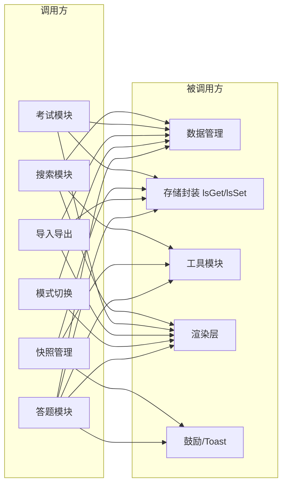

# 模块关系图

> 题库项目模块职责与调用关系
> 主文件：`[题库]交互式刷题页面.html`

---

## 1. 核心模块关系图

下图展示六大模块族及其调用关系。实线箭头表示"主动调用"，颜色按模块族区分。

```mermaid
flowchart TB
    subgraph DATA_MGMT["数据管理模块"]
        direction TB
        questions["questions[]<br/>题库数组（软初始化自 ALL_QUESTIONS）"]
        wrong["wrongSet<br/>错题集合"]
        done["doneSet<br/>已做集合"]
        fav["favSet<br/>收藏集合"]
        srs["srsMap<br/>SM-2 间隔复习数据<br/>{id: {ef, interval, rep, next, last}}"]
        wrongCount["wrongCountMap<br/>错题次数映射"]
        sources["sources[]<br/>类别列表"]
        dailyHist["dailyHistory<br/>每日统计（90天上限）"]
    end

    subgraph ANSWER_MGMT["答题模块"]
        direction TB
        renderQ["renderQuestion<br/>渲染当前题"]
        handleOpt["handleOptionClick<br/>选项点击 + 判定对错"]
        redo["redoQuestion<br/>重做当前题"]
        goNext["goNext / nextQuestion<br/>下一题"]
        prev["prevQuestion<br/>上一题"]
        jump["jumpTo<br/>跳转指定题号"]
        undo["undoLastAnswer<br/>Ctrl+Z 撤销"]
    end

    subgraph MODE_MGMT["模式切换模块"]
        direction TB
        wrongMode["toggleWrongMode<br/>错题模式"]
        favMode["toggleFavMode<br/>收藏模式"]
        reviewMode["toggleReviewMode<br/>复习模式（SM-2）"]
        browseMode["toggleBrowseMode<br/>浏览模式"]
        exitAll["exitAllModes<br/>退出全部模式"]
        applyF["applyFilter<br/>核心筛选器"]
        banners["updateModeBanners<br/>复合横幅渲染"]
    end

    subgraph AUX_MGMT["辅助模块"]
        direction TB
        timer["计时模块<br/>startTimer / stopTimer / updateTimerDisplay"]
        alarm["闹钟模块<br/>saveAlarm / toggleAlarmEnabled / updateAlarmStatus"]
        goal["目标模块<br/>saveGoal / incrementDailyCount / updateGoalDisplay"]
        report["报告模块<br/>buildReport / computeSrcStats / renderReportCharts"]
        search["搜索模块<br/>buildSearchIndex / doSearch / searchJump"]
        enc["鼓励模块<br/>checkEncouragement / showEncouragement"]
    end

    subgraph UTIL_MGMT["工具模块"]
        direction TB
        escapeH["escapeHtml<br/>XSS 转义"]
        toast["showToast<br/>通知"]
        confirm["showConfirm<br/>确认弹窗（Promise）"]
        prompt["showPrompt<br/>输入弹窗（Promise）"]
        focusM["focusModal<br/>焦点管理"]
        getById["getQuestionById<br/>ID 查题（带缓存）"]
    end

    subgraph STORE_MGMT["存储模块"]
        direction TB
        snapshot["saveSnapshot / restoreSnapshot<br/>deleteSnapshot / getSnapshotList"]
        impexp["exportData / importData<br/>importQuestionsFromFile"]
        ls["lsGet / lsSet<br/>localStorage 封装"]
        autobackup["triggerAutoBackup<br/>防抖 2 秒"]
        evict["evictOldestSnapshot<br/>淘汰最旧快照"]
        quota["checkStorageUsage<br/>配额检测"]
    end

    handleOpt --> wrong
    handleOpt --> done
    handleOpt --> wrongCount
    handleOpt --> srs
    handleOpt --> renderQ

    applyF --> wrong
    applyF --> fav
    applyF --> srs
    applyF --> done
    applyF --> renderQ

    wrongMode --> applyF
    favMode --> applyF
    reviewMode --> applyF
    browseMode --> applyF
    exitAll --> applyF

    renderQ --> fav
    renderQ --> getById
    renderQ --> escapeH
    handleOpt --> toast
    handleOpt --> enc
    handleOpt --> goal

    autobackup --> snapshot
    snapshot --> ls
    snapshot --> evict
    snapshot --> confirm
    restoreSnapshot --> confirm
    impexp --> ls
    impexp --> questions
    impexp --> sources

    search --> getById
    search --> escapeH
    report --> getById
    report --> escapeH
    timer --> ls
    alarm --> ls
    goal --> ls

    wrong --> ls
    done --> ls
    fav --> ls
    srs --> ls
    wrongCount --> ls
    questions --> ls
```

---

## 2. 模块间调用关系矩阵

下表展示主要模块族之间的调用方向（→ 表示调用方 → 被调用方）。

---

## 3. 模块职责边界

### 3.1 数据管理模块

**职责**：维护全局状态变量，提供状态读取与原子更新。

| 状态变量 | 类型 | 持久化键 | 更新入口 |
|---------|------|---------|---------|
| `questions` | `Array<Question>` | `tiku_v8_questions` | `saveQuestions` |
| `wrongSet` | `Set<number>` | `tiku_v8_wrong` | `saveWrong` |
| `doneSet` | `Set<number>` | `tiku_v8_done` | `saveDone` |
| `favSet` | `Set<number>` | `tiku_v8_fav` | `saveFav` |
| `wrongCountMap` | `Object<id, count>` | `tiku_v8_wrongCount` | `saveWrongCount` |
| `srsMap` | `Object<id, SRSState>` | `tiku_v8_srs` | `saveSRS` |
| `sources` | `Array<string>` | `tiku_v8_sources` | `saveSources` |
| `dailyHistory` | `Object<date, stat>` | `tiku_v8_dailyHistory` | `saveDailyHistory` |

**边界**：仅负责状态本身，不触发 UI 渲染。UI 渲染由调用方在状态更新后自行触发。

### 3.2 答题模块

**职责**：处理用户答题交互，更新对应状态集合。

- `renderQuestion`：渲染当前题的题干、选项、元信息、徽章。
- `handleOptionClick`：判定对错 → 更新 `doneSet` / `wrongSet` / `wrongCountMap` / `srsMap` → 触发反馈卡 → 自动进入下一题（答对时延 800ms）。
- `redoQuestion`：清除当前题的答题态，允许重做。
- `undoLastAnswer`：Ctrl+Z 撤销上一次答题的状态变更（依赖 `undoSlot` 快照）。

**边界**：仅操作"当前题"的状态，不直接修改全局筛选条件。

### 3.3 模式切换模块

**职责**：管理 4 种筛选模式（错题/复习/收藏/浏览）的开关与组合。

- 支持任意组合（如 错题+复习+收藏 三重复合）。
- `applyFilter` 是核心筛选器：根据当前激活的模式从 `questions` 中过滤 → 排序（未做在前、已做在后）→ 可选随机（`shuffleMode`）→ 写入 `filteredQuestions`。
- `updateModeBanners`：当激活模式 ≥ 2 时显示复合横幅，否则显示单模式横幅。
- 单模式开启且筛选结果为空时自动关闭该模式；多模式复合时保持开启，由空状态 UI 提示用户。

**边界**：不直接修改 `wrongSet` 等状态，只读取状态做筛选。

### 3.4 辅助模块

| 子模块 | 职责 | 触发时机 |
|-------|------|---------|
| 计时 | 累计学习时长（总/今日），每秒自增 | 页面加载 / `visibilitychange` |
| 闹钟 | 自定义周期提醒（默认 45 分钟，可循环） | 计时器每秒检查 |
| 目标 | 每日刷题数目标，达成时鼓励弹窗 | `incrementDailyCount` |
| 报告 | 渲染 Chart.js 4 图表 + 类别统计 + 错题 Top | `openReportModal` |
| 搜索 | 关键词 + `#ID` 精准定位，最多 30 条 | `/` 键或点击搜索按钮 |
| 鼓励 | 每 50 题弹鼓励，1 小时后每 30 分钟弹休息 | `checkEncouragement` / 计时器 |

**边界**：辅助模块互相解耦，通过全局状态读取数据，不互相直接调用（除鼓励模块被答题模块触发）。

### 3.5 工具模块

**职责**：提供基础设施，无业务状态。

- `escapeHtml`：所有动态 HTML 插入前的 XSS 转义（项目核心安全防线）。
- `showToast` / `showConfirm` / `showPrompt`：统一的反馈/确认/输入组件，`showConfirm` 与 `showPrompt` 返回 Promise 便于链式调用。
- `focusModal`：弹窗打开后自动聚焦，支持 Esc 关闭与键盘焦点循环。
- `getQuestionById`：基于 `questionByIdMap` 的 O(1) 查找，`questionByIdMap` 在 `saveQuestions` / `loadAll` 后通过 `rebuildQuestionMap` 重建。

**边界**：纯函数 / 无副作用 UI 工具，可被任意模块调用。

### 3.6 存储模块

**职责**：localStorage 的统一封装层。

- `lsGet(k, def)`：读取 + `JSON.parse` + try-catch 兜底返回 `def`。
- `lsSet(k, v)`：`JSON.stringify` + 写入；配额超限时先尝试 `evictOldestSnapshot`（删最旧快照）再重试；仍失败则 `showQuotaToast` 提示。
- `triggerAutoBackup`：防抖 2 秒，避免连续答题触发频繁快照。
- `saveSnapshot`：生成时间戳 → 写入 `snap_<ts>` → 更新 `snapIndex` → 超过 10 份淘汰最旧 → 同步 `lastBackup` 时间戳。
- `restoreSnapshot` / `deleteSnapshot`：均通过 `showConfirm` 二次确认后执行。
- `checkStorageUsage`：通过 `navigator.storage.estimate()` 检测，超 10MB 提示导出。

**边界**：所有 localStorage 访问必须经过 `lsGet` / `lsSet`，禁止直接调用 `localStorage.getItem` / `setItem`（仅 `lastBackup` 等纯字符串时间戳例外）。

---

## 4. 耦合度分析

### 4.1 高耦合点（已知，可接受）

- **`handleOptionClick` ↔ 多个状态集合**：一次答题同时更新 `doneSet` / `wrongSet` / `wrongCountMap` / `srsMap`，是业务上不可避免的耦合。
- **`applyFilter` ↔ 渲染层**：筛选完成后必须立即渲染，否则 UI 与状态不一致。
- **`saveSnapshot` 数据结构**：快照包含几乎所有状态字段，任何新增状态都需同步更新 `saveSnapshot` / `restoreSnapshot` / `importData` / `exportData` 四处。

### 4.2 低耦合点（设计良好）

- **辅助模块之间**：计时、闹钟、目标、报告、搜索互相不调用，通过全局状态间接通信。
- **工具模块**：纯函数，无状态依赖，可被任意模块复用。
- **模式切换 ↔ 答题**：模式切换只改 `filteredQuestions`，不触碰答题逻辑；答题逻辑不关心当前处于何种模式。

### 4.3 改进空间

- `saveSnapshot` 的数据结构散落在 `triggerAutoBackup` / `autoBackupNow` / `exportData` 三处重复定义，可提取为 `collectAllState()` 工具函数（YAGNI 原则下，当前重复仅 3 处，未触发规则补丁阈值）。
- `restoreSnapshot` / `importData` / `checkAutoRestore` 中的状态恢复逻辑高度相似，可考虑提取 `applyStateData(data, merge)` 公共函数。
