# 页面流程图

> 题库项目（`[题库]交互式刷题页面.html`，v1.0.0）
> 纯前端 localStorage 持久化的通用刷题系统（内置临床医学题库样例）

---

## 1. 启动加载流程

页面打开后的初始化序列。`DOMContentLoaded` 触发后依次加载持久化数据、重建索引、渲染首屏。

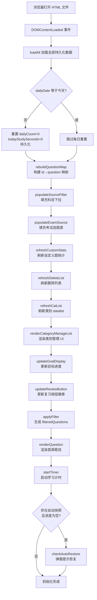

---

## 2. 答题主流程

用户答题时的核心交互流。一次答题会同时更新多个状态集合，答对自动跳下一题，答错停留。

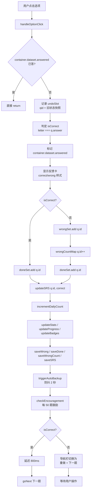

---

## 3. 模式切换流程

4 种模式（错题 / 复习 / 收藏 / 浏览）的开关与组合逻辑。多模式同时开启进入复合模式（交集刷题）。

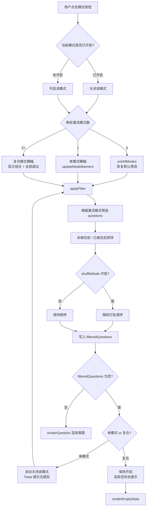

---

## 4. 模拟考试流程

从选题源到交卷判分的完整考试流程。支持错题本组卷、双计时（单题 + 整场）、分页作答。

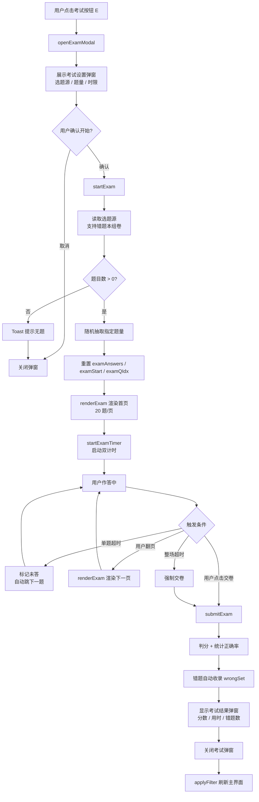

---

## 5. 全局搜索流程

关键词搜索 + `#ID` 精准定位。搜索索引分批构建（每批 500 题）避免阻塞主线程。

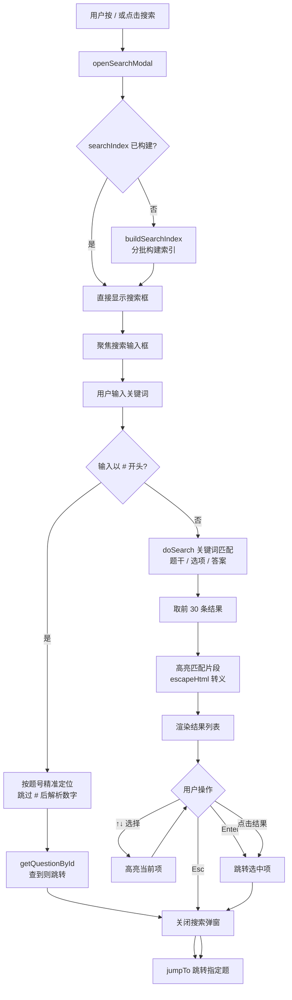

---

## 6. 学习报告流程

Chart.js 4 图表 + 错题 Top 8 排名 + 智能学习建议。关闭时销毁图表实例释放内存。

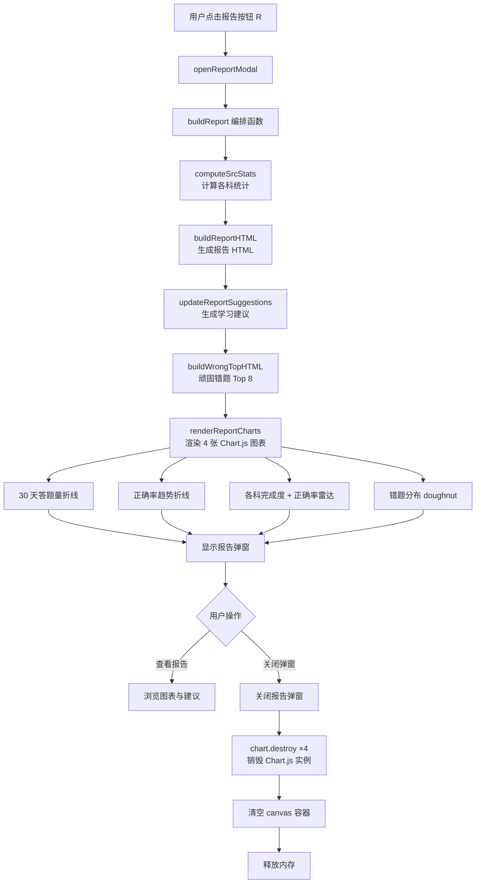

---

## 7. 数据管理流程

数据管理弹窗聚合了快照、导入导出、类别管理、自定义题等功能入口。

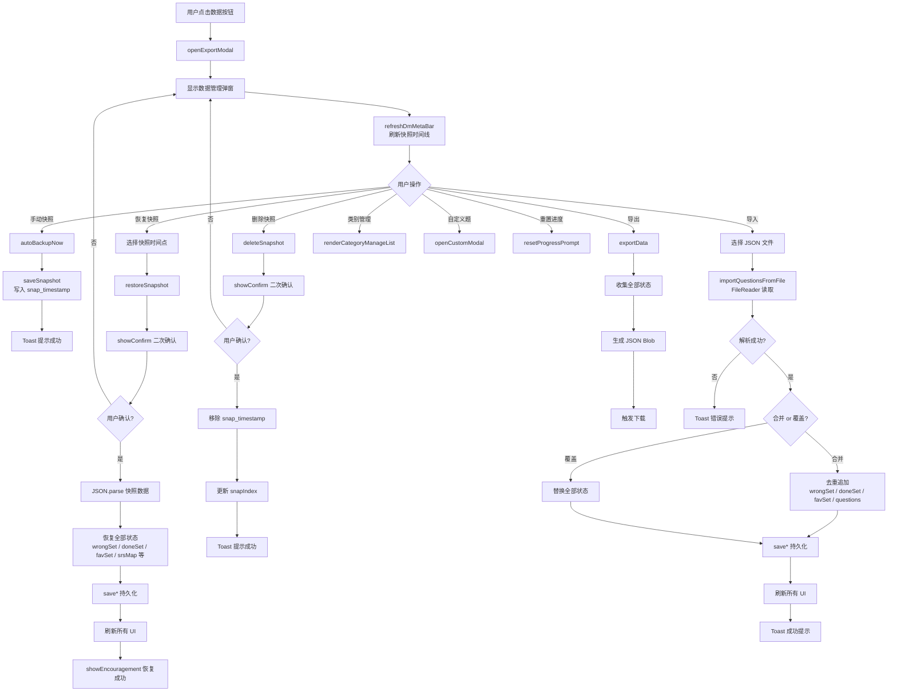

---

## 8. 模态弹窗导航关系

10 个模态弹窗的打开路径与关系。所有弹窗支持 Esc 关闭 + 点击遮罩关闭 + `focusModal` 自动聚焦。

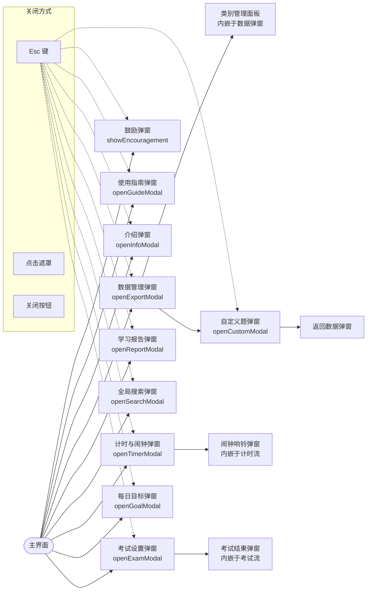

---

## 9. 键盘快捷键流程

全局键盘事件处理。input/select/textarea 聚焦时屏蔽（保留 Ctrl+Z 与 Esc），弹窗打开时屏蔽模式切换键。

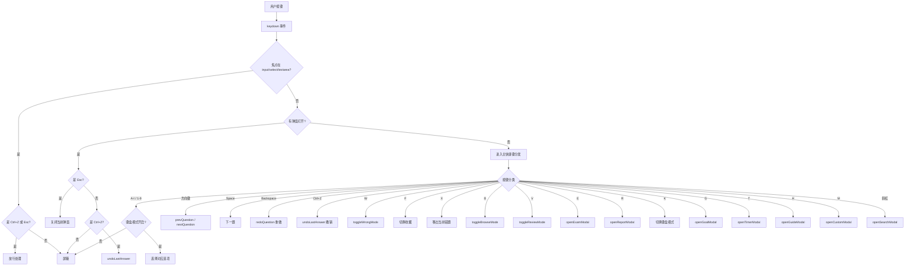

---

## 10. 计时与闹钟流程

学习计时 + 自定义闹钟 + 系统休息提醒三者协同。计时器每秒自增，闹钟先到者响。

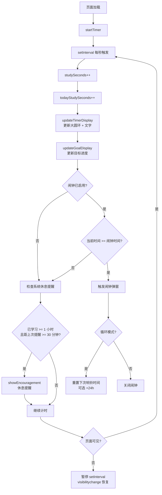

---

## 11. SRS 间隔复习调度流程

SM-2 算法决定每道题的下次复习时间。答对拉长间隔，答错次日复习。

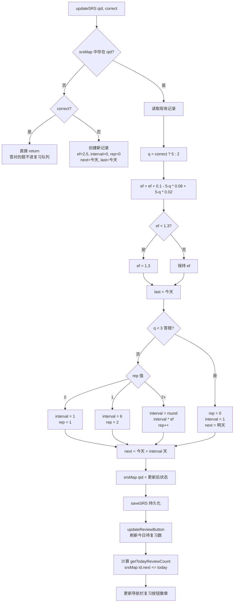

---

## 12. 页面状态机总览

主界面的核心状态机。用户在不同模式间切换时，`applyFilter` 重新生成 `filteredQuestions` 并触发渲染。

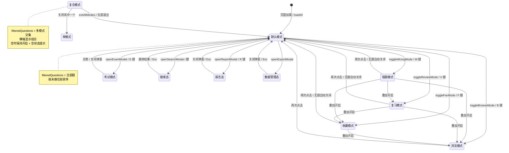
