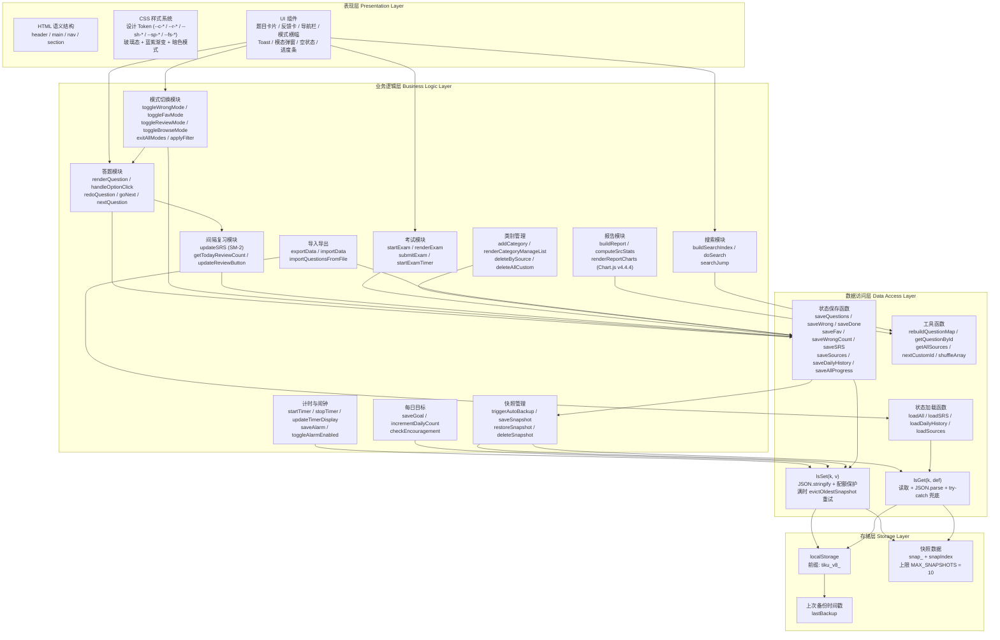
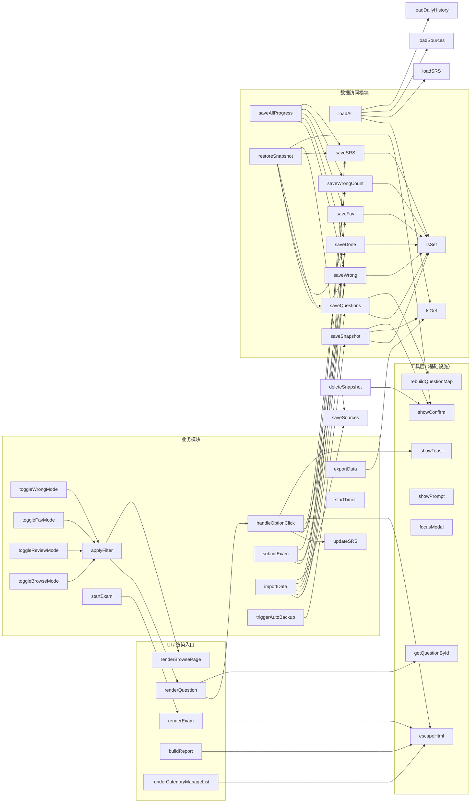

# 系统架构图

> 题库项目（`[题库]交互式刷题页面.html`，v1.0.0）
> 纯前端 localStorage 持久化的通用刷题系统（内置临床医学题库样例）

---

## 1. 整体架构分层

系统采用经典四层架构，自上而下分别为表现层、业务逻辑层、数据访问层和存储层。所有代码内联在单一 HTML 文件中，无构建步骤、无后端服务。

---

## 2. 模块依赖关系

下图展示核心模块之间的调用依赖。工具层（`escapeHtml` / `showToast` / `showConfirm` / `showPrompt` / `focusModal`）作为基础设施被几乎所有模块引用，单独画在最底层。

---

## 3. 架构设计说明

### 3.1 设计原则

1. **单文件分发优先**：整个应用内联在一份 HTML 文件中，用户双击即可运行，无需安装、无需服务器、无需构建。这是本项目最核心的架构决策，所有其他决策都从属于它。

2. **数据本地化**：所有学习数据存在浏览器 `localStorage`（前缀 `tiku_v8_`），不上传任何服务器。`exportData` / `importData` 走本地 JSON 文件，不经过网络。这决定了安全模型（XSS 防护优先，无 CSRF / 鉴权需求）。

3. **状态与渲染分离**：业务模块只负责更新全局状态变量（`wrongSet` / `doneSet` / `favSet` / `srsMap` / `wrongCountMap` 等），状态变更后通过 `renderQuestion` / `renderBrowsePage` / `renderExam` / `updateBadges` 等渲染函数刷新 UI。状态变更是单一信任源。

4. **写穿透（Write-Through）**：每次状态变更立即调用对应的 `save*` 函数持久化，再触发 `triggerAutoBackup`（防抖 2 秒）生成快照。不会出现"内存已改但未落盘"的中间态。

5. **失败显性化**：`lsSet` 在配额超限时尝试 `evictOldestSnapshot` 释放空间并重试；重试仍失败则通过 `showQuotaToast` 显式提示用户导出备份。错误不吞掉。

### 3.2 单文件设计决策

- **优势**：分发零依赖、可离线运行、版本可控（一份文件即一个版本）、便于学生间分享。
- **代价**：文件体积约 2.7MB（含约 6000 道题的题库常量 `ALL_QUESTIONS`），首屏解析略慢，但本地加载无网络延迟，可接受。
- **取舍**：函数规模控制在 50 行以内、IIFE 隔离 DOMContentLoaded 内的逻辑、CSS 通过设计 Token 集中管理，缓解单文件的可维护性问题。

### 3.3 无框架选择理由

| 维度 | 选 Vanilla JS | 不选 React/Vue 的原因 |
|------|--------------|---------------------|
| 分发 | 双击即用 | 需构建步骤 + 打包产物 |
| 体积 | 0 KB 框架运行时 | 至少 +30 KB |
| 学习数据 | 直接操作 localStorage | 框架状态管理对单文件过度 |
| DOM 操作 | 量小且集中（renderQuestion / renderExam / renderBrowsePage）| 虚拟 DOM 优势不显著 |
| Chart.js | 已通过 CDN 加载 | 与框架无关，独立工作 |

仅引入一个外部依赖：**Chart.js v4.4.4**（CDN，`defer` 加载），用于学习报告的 4 个图表。其余所有功能均用原生 Web API 实现。

### 3.4 关键架构约束

- `STORAGE_PREFIX = 'tiku_v8_'`：所有 localStorage 键统一前缀，避免与其他应用冲突。
- `MAX_SNAPSHOTS = 10`：快照数量上限，超出后自动 `evictOldestSnapshot` 淘汰最旧。
- `STORAGE_QUOTA_WARN_BYTES = 10MB`：通过 `navigator.storage.estimate()` 检测，超阈值提示导出。
- `dailyHistory` 自动截断到 90 天，防止长期使用后无限增长。
- 暗色模式通过 `matchMedia('(prefers-color-scheme: dark)')` 跟随系统，无需用户切换。
